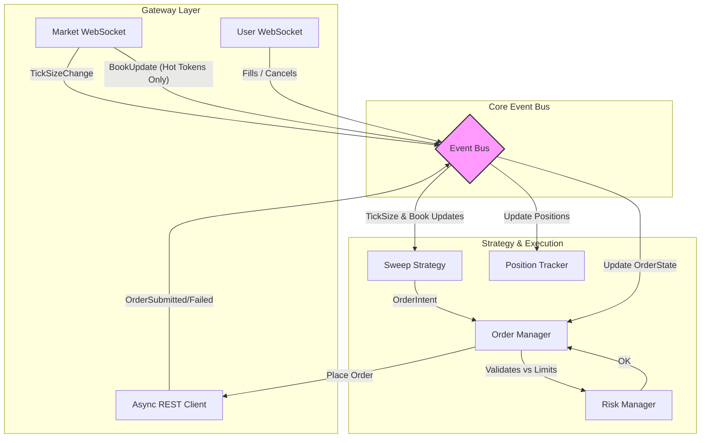
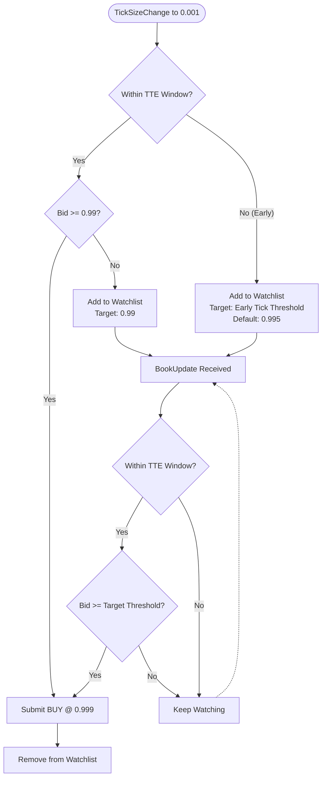

# Polymarket Bot

A Python bot for Polymarket with multiple modes:

1. **Single Trade Mode** – Place a test limit order given an event slug, price, and direction
2. **Trading Bot Mode** – For 15-min crypto Up/Down events: wait for event end, detect winning outcome, place 1 share @ 0.999 limit order on the winning side
3. **Book Monitor Mode** – Monitor WebSocket orderbook updates and log bids placed at the 0.999 price level
4. **Multi-Event Monitor Mode** – Monitor multiple event slugs simultaneously via WebSocket
5. **Continuous Crypto Monitor Mode** – Automatically track current 5-minute or 15-minute crypto markets
6. **Trade Cross-Referencing** – Match wallet trades against sweeper analysis data
7. **Trade Resolution** – Resolve win/loss for all wallet trades via Gamma API

## Setup

```bash
python3 -m venv .venv
source .venv/bin/activate  # On Windows: .venv\Scripts\activate
pip install -r requirements.txt
cp .env.example .env
# Edit .env with your PRIVATE_KEY and FUNDER address
```

## How to Run

Activate the virtual environment first (if not already active):

```bash
source .venv/bin/activate  # On Windows: .venv\Scripts\activate
```

**Single trade** (place one test order):

```bash
python main.py trade --slug <event-slug> --price <0.0-1.0> --direction <up|down|yes|no>
```

**Trading bot** (15-min crypto – waits for event end, then places order on winning side):

```bash
python main.py bot --slug <event-slug>
# or
python run_bot.py <event-slug>
```

The event slug comes from the Polymarket URL: `https://polymarket.com/event/<slug>`.

## Usage

### Single Trade (Testing)

```bash
python main.py trade --slug <event-slug> --price <0.0-1.0> --direction <up|down|yes|no>
```

Example:
```bash
python main.py trade --slug btc-15m-20250101-1200 --price 0.50 --direction up
```

### Trading Bot (15-min Crypto)

```bash
python main.py bot --slug <event-slug>
```

Or use the dedicated entry point:
```bash
python run_bot.py <event-slug>
```

The bot will:
1. Fetch the event and validate it's a 15-min crypto market
2. Wait until the event end time + resolution buffer
3. Poll for resolution and determine the winning outcome
4. Place a limit order for 1 share @ $0.999 on the winning side

### Book Monitor (Analyze 0.999 Price Bids)

Monitor the Polymarket CLOB for bids placed at the 0.999 price level. This helps analyze when traders place their bids at this specific price point.

#### Option 1: WebSocket Monitor (Recommended)

Real-time monitoring using WebSocket connection:

First, get the token ID for your market:

```bash
python get_token_ids.py --slug <event-slug>
```

Then monitor the orderbook:

```bash
python monitor_book_bids.py --token-id <token-id>
```

#### Option 2: REST API Polling (Alternative)

If WebSocket connection is difficult, use the REST API polling version:

```bash
python monitor_book_bids_rest.py --token-id <token-id> --interval 1.0
```

This polls the orderbook every second (or your specified interval). It's simpler but less efficient than WebSocket.

#### Data Output

Both scripts will:
1. Monitor the specified token's orderbook (WebSocket) or poll it (REST)
2. Log every new bid placed at the 0.999 price level
3. Save data to `bids_0999.csv` with millisecond timestamps for analysis

The CSV output includes:
- `timestamp_ms`: Unix timestamp in milliseconds
- `timestamp_iso`: ISO 8601 formatted timestamp with milliseconds
- `price`: The bid price (should be 0.999)
- `size`: Total size of bids at this price level
- `size_change`: The increase in size from the previous update
- `token_id`: The token being monitored

You can then use this CSV file with any data visualization tool (Excel, pandas, matplotlib, etc.) to analyze the timing patterns of 0.999 bids.

To quickly visualize the data, use the included script:

```bash
# Quick text analysis (no dependencies)
python analyze_bids.py bids_0999.csv

# Visual charts (requires pandas & matplotlib)
pip install pandas matplotlib  # Install visualization dependencies
python visualize_bids.py bids_0999.csv
```

This will generate charts and statistics showing bid activity patterns over time. See `BOOK_MONITOR.md` for more details.

### Multi-Event Monitoring

Monitor multiple market events simultaneously with automatic market status tracking. See `MULTI_EVENT_MONITORING.md` for detailed documentation.

**Monitor specific event slugs:**

```bash
python monitor_multi_events.py multi --slugs slug1 slug2 slug3
```

**Continuously monitor crypto markets (5-min or 15-min):**

```bash
# 15-minute markets (default)
python monitor_multi_events.py continuous --markets BTC ETH SOL XRP --duration 15

# 5-minute markets
python monitor_multi_events.py continuous --markets BTC ETH SOL XRP --duration 5

# Legacy alias (equivalent to --duration 15)
python monitor_multi_events.py continuous-15min --markets BTC ETH SOL
```

Features:
- Monitor multiple markets simultaneously via a single WebSocket connection
- Automatic market status tracking — closes WebSocket when all markets end
- Flexible `--duration` flag supports 5-minute and 15-minute market windows
- Automatically generates correct slugs for current market periods and rolls to the next window
- Records `condition_id` and `raw_slug` for reliable cross-referencing with wallet trades
- All data saved to a unified CSV (`sweeper_analysis.csv`) for analysis

See `MULTI_EVENT_MONITORING.md` for complete usage examples and documentation.

### Wallet Trade Fetching

Fetch trade history for any Polymarket wallet and export to CSV:

```bash
python fetch_wallet_trades.py --wallet 0xABC... --start 2026-02-20 --end 2026-02-21 --output wallet_trades.csv
```

Optional `--min-price 0.95` flag filters for high-price trades (useful for sweep detection).

### Trade Cross-Referencing

Match wallet trades against sweeper analysis data to see which trades the sweeper was monitoring and whether the trader won or lost:

```bash
python match_trades.py --wallet wallet_trades.csv --sweeper sweeper_analysis.csv --output matched_trades.csv
```

Matching priority:
1. **CONDITION_ID** — exact market instance match (most reliable)
2. **EXACT** — event slug + token ID match
3. **SLUG-ONLY** — same market time-slot, possibly different day

Both 5-minute and 15-minute markets are included in the cross-reference.

### Trade Resolution

Resolve win/loss for every wallet trade by querying the Polymarket Gamma API for market outcomes. This answers the question: *"Did this trader win or lose each position?"*

```bash
python resolve_trades.py
python resolve_trades.py --wallet wallet_trades.csv --output resolved_trades.csv
```

The script will:
1. Load wallet trades and aggregate fills into positions
2. Query the Gamma API for each unique `condition_id` to fetch market resolution
3. Compare the trader's token to the winning token → **WIN** or **LOSS**
4. Print a summary with overall and per-duration (5min / 15min) win rates
5. Write detailed results to `resolved_trades.csv`

Output columns include `result` (WIN / LOSS / UNRESOLVED), `winning_outcome`, `winning_token`, `duration`, and all position details.

## Sweep Strategy Architecture

The bot uses a highly optimized, event-driven architecture designed to capture the spread to $1.00 at settlement in crypto Up/Down markets by placing BUY orders at $0.999.

### High-Level Event Flow



#### Performance Optimizations

1.  **Lazy Subscription**: To prevent WebSocket throttling and Event Bus starvation, long-duration markets (e.g., 60-minute) are not subscribed to immediately. The Bot delays subscribing to these markets until they are within 15 minutes of expiry (`LAZY_SUB_LEAD_S`).
2.  **Early Book Update Filtering**: The `MarketWebSocket` performs lightweight price extraction for all tokens, but only publishes expensive `BookUpdate` events to the Event Bus for "hot tokens" currently being actively watched by strategies.
3.  **Granular Latency Tracking**: Every `OrderState` tracks precise latency metrics (`handler_start_ns`, `signal_ns`, `rest_response_ns`) to break down the `tick→order` delay into Event Bus queue wait (`bus`), Strategy Evaluation (`eval`), and HTTP Request (`rest`).

### Strategy Decision Flow

When a market's tick size drops to `0.001` (indicating the market is approaching settlement), the Sweep Strategy evaluates the market:



### Key Components

| Component | Role |
|-----------|------|
| `MarketWebSocket` | Single WS connection publishing `BookUpdate` and `TickSizeChange` events. Filters out noise. |
| `EventBus` | Routes immutable events (dataclasses) to strategy and execution layers asynchronously. |
| `SweepStrategy` | Pure logic — receives events, calculates TTE/price thresholds, returns `OrderIntent` objects. |
| `OrderManager` | Dedup, risk check, async REST submission, and full lifecycle tracking (Live, Partial, Filled, Terminal). |
| `PositionTracker` | Tracks fills and Calculates Unrealized/Realized P&L without subscribing to raw BookUpdates. |

### Running the Bot

```bash
# Dry run with dashboard (no real orders)
python main.py run --dry-run --dashboard

# Live trading
python main.py run --markets BTC --durations 5 15

# Custom threshold
python main.py run --markets BTC ETH --price-threshold 0.98
```

## Configuration

See `.env.example` for required variables. You need a Polymarket account with funded USDC and the appropriate wallet setup (EOA, email/Magic, or browser proxy).

## AWS Deployment (Production)

The bot includes a fully automated, cost-optimized deployment setup for AWS EC2 using Terraform. It runs on a `t4g.nano` instance (~$3/month) and uses `systemd` + `tmux` to keep the bot running in the background while allowing you to attach to the live dashboard at any time.

### 1. Initial Setup

1. Install [Terraform](https://developer.hashicorp.com/terraform/downloads) and the [AWS CLI](https://docs.aws.amazon.com/cli/latest/userguide/getting-started-install.html).
2. Configure your AWS credentials (`aws configure`).
3. Add your secrets to AWS Systems Manager Parameter Store in the `eu-west-1` region (or your chosen region). Create them as `SecureString`:
   - `/polymarket-bot/PRIVATE_KEY`
   - `/polymarket-bot/POLYGON_RPC_URL`
   - `/polymarket-bot/FUNDER`
   - *(Any other variables from `.env`)*

### 2. Provision Infrastructure

```bash
cd terraform
terraform init
terraform apply
```

This will create the VPC, Security Groups, IAM Roles, S3 Bucket (for SQLite backups via Litestream), and the EC2 instance. The instance will automatically download the code, fetch your secrets, and start the bot.

### 3. View the Live Dashboard

You do not need SSH keys. Connect securely using AWS SSM:

```bash
# Get the instance ID from terraform output
aws ssm start-session --target <instance-id> --region eu-west-1

# Once connected, attach to the tmux session:
tmux attach -t bot
```

*To detach and leave the bot running, press `Ctrl+B`, then `D`.*

### 4. Deploying Updates

When you make changes to the code locally, push them to GitHub, then run the deploy script:

```bash
./deploy/deploy.sh
```

This script will connect to the EC2 instance, pull the latest code, update dependencies, and restart the bot service automatically.

## Logging

Set `LOG_LEVEL=DEBUG` in `.env` for verbose output. All trading actions and API responses are logged to help debug why orders didn't go through.
