# Trade Analysis — doggystyie_2026-06-12_2026-07-11

## 1. Crypto P&L (all)

| crypto   |   positions |   resolved |     pnl |    buy_cost |   wins |   losses |   roi_pct |   win_rate_pct |
|:---------|------------:|-----------:|--------:|------------:|-------:|---------:|----------:|---------------:|
| BTC      |       14935 |      14922 | 87411.9 | 4.88087e+06 |   7470 |     7452 |      1.79 |          50.06 |

## 2. Crypto × market-type P&L (all)

|                 |   positions |     pnl |    buy_cost |   wins |   losses |   roi_pct |   win_rate_pct |
|:----------------|------------:|--------:|------------:|-------:|---------:|----------:|---------------:|
| ('BTC', '5min') |       14935 | 87411.9 | 4.88087e+06 |   7470 |     7452 |      1.79 |          50.06 |

## 3. BTC dataset — per market type

| market_type   |   markets |   trades |   avg_trades_per_market |   avg_size |   median_size |   min_size |   max_size |   avg_price |   min_price |   max_price |   total_volume_usdc |
|:--------------|----------:|---------:|------------------------:|-----------:|--------------:|-----------:|-----------:|------------:|------------:|------------:|--------------------:|
| 5min          |      7480 |   195089 |                 26.0814 |    49.4646 |            60 |       0.24 |        200 |      0.4914 |       0.001 |        0.99 |         4.88087e+06 |

## 4. BTC strategy-inference metrics

- **side_counts**: {'BUY': 195089}
- **buy_pct**: 100.0000
- **markets_total**: 7480
- **markets_both_sides**: 7455
- **both_sides_pct**: 99.6658
- **entry_offset_median_s**: 125.0000
- **entry_offset_p25_s**: 62.0000
- **entry_offset_p75_s**: 194.0000
- **avg_fills_per_leg**: 13.0625
- **avg_distinct_prices_per_leg**: 11.9470
- **avg_price_span_per_leg**: 0.4382
- **avg_shares_per_leg**: 646.1326
- **median_shares_per_leg**: 600.0000
- **sell_to_buy_ratio_pct**: 0.0000
- **win_rate_pct**: 50.0603
- **total_pnl**: 87,411.8512
- **total_buy_cost**: 4,880,871.5365
- **roi_pct**: 1.7909
- **avg_buy_price_winners**: 0.6250
- **avg_buy_price_losers**: 0.3859
- **market_profit_pct**: 80.0267
- **market_loss_pct**: 19.7594
- **avg_market_win**: 16.5769
- **avg_market_loss**: -7.9955

## 5. Profit theory — how they make money

Every winning share redeems at $1, so the exact edge is `share_win_rate − avg_price_per_share`. Compare the share-weighted **Up+Down pair cost** to $1.00 (below = hedge bought under fair value) and check **net-long side won %** for a directional tilt.

### All cryptos

- markets: 7,480 (7,455 two-sided)
- shares bought: 9,649,991 for $4,880,871.54
- **avg price/share**: $0.5058
- **Up+Down pair cost (share-weighted)**: $1.0116 (above $1.00 fair value)
- **share win rate**: 51.48%
- **edge/share**: $0.0091 (= win rate − avg price)
- total P&L: $87,411.85  (ROI 1.79%)
- hedged shares: 99.1% of book
- net-long side won: 53.7% of two-sided markets

### BTC only

- markets: 7,480 (7,455 two-sided)
- shares bought: 9,649,991 for $4,880,871.54
- **avg price/share**: $0.5058
- **Up+Down pair cost (share-weighted)**: $1.0116 (above $1.00 fair value)
- **share win rate**: 51.48%
- **edge/share**: $0.0091 (= win rate − avg price)
- total P&L: $87,411.85  (ROI 1.79%)
- hedged shares: 99.1% of book
- net-long side won: 53.7% of two-sided markets

## 6. Accumulation & direction (BTC)

Does the algo lean toward the winner, and does the lean develop over the window? Flat ~50% + mostly-balanced books = a symmetric ladder; a rising lean = active directional quote management (gabagool22-style).

- **first_fill_on_winner_pct**: 53.1727
- **markets_balanced_pct**: 61.7938
- **markets_winner_heavy_pct**: 24.5917
- **markets_loser_heavy_pct**: 13.6145
- **avg_net_winner_shares**: 3.6414
- **avg_total_shares_per_market**: 1,291.2679

## 7. Choppiness vs edge (BTC)

P&L and per-share edge by within-market price choppiness. Per-share edge controls for position size.

| flips   |   markets |   avg_flips |   avg_pnl |   edge_per_share |   total_pnl |
|:--------|----------:|------------:|----------:|-----------------:|------------:|
| calm    |      1825 |      6.4526 |    6.8383 |           0.014  |     12479.9 |
| q2      |      1825 |     14.686  |   10.853  |           0.0103 |     19806.8 |
| q3      |      1825 |     22.1616 |   14.1242 |           0.0091 |     25776.7 |
| choppy  |      1825 |     34.5704 |   15.981  |           0.0074 |     29165.3 |

## 8. Charts

### pnl by crypto

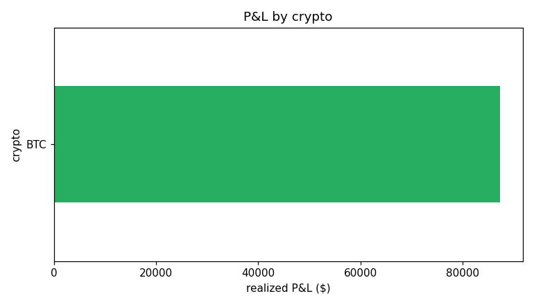

*Realized P&L by crypto.*

### pnl by crypto market type

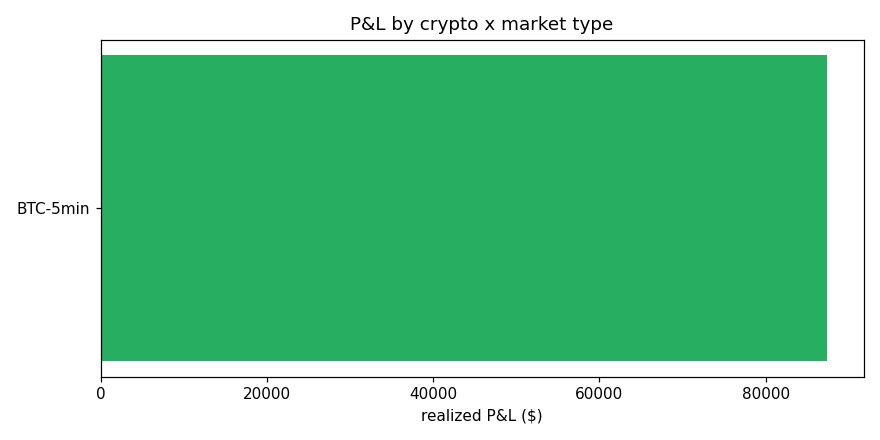

*Realized P&L for every crypto x market-type segment.*

### btc pnl by market type

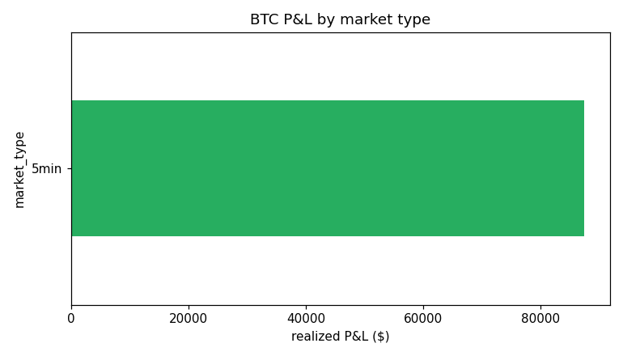

*BTC realized P&L by market duration.*

### btc price hist

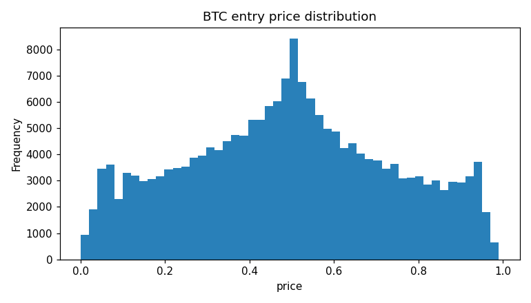

*Distribution of prices paid per fill (laddering signature).*

### btc size hist

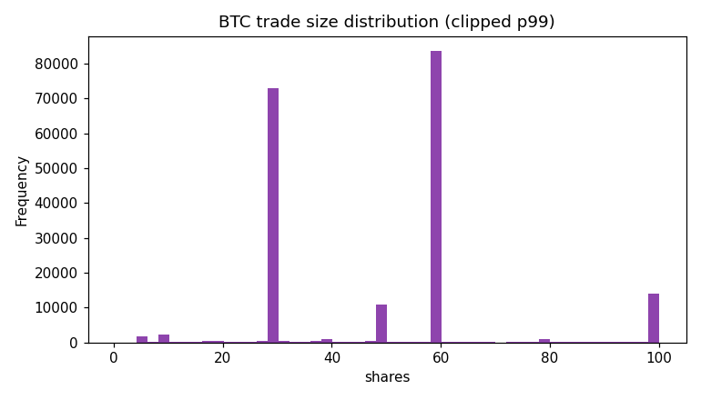

*Per-fill size distribution (sizing pattern).*

### btc entry timing

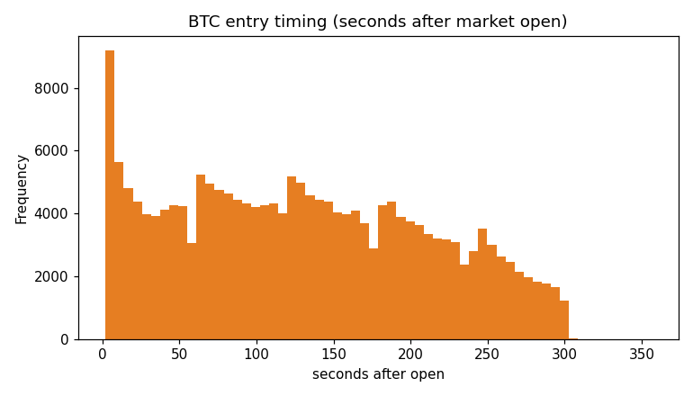

*When in the window entries occur (0 = market open).*

### btc trades by hour

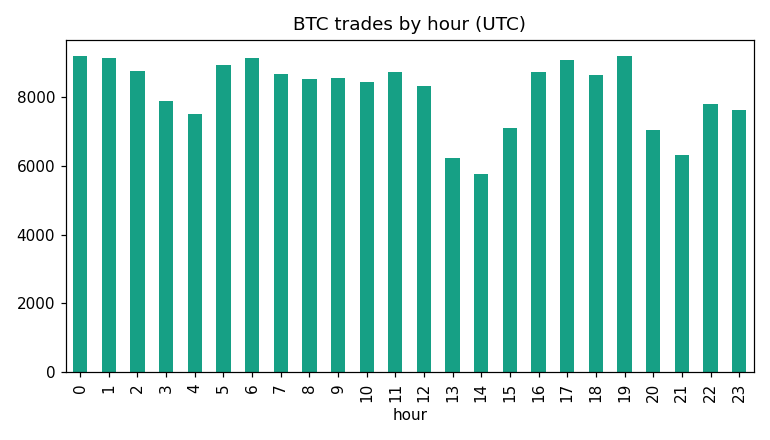

*Activity by hour of day (UTC).*

### btc cumulative pnl

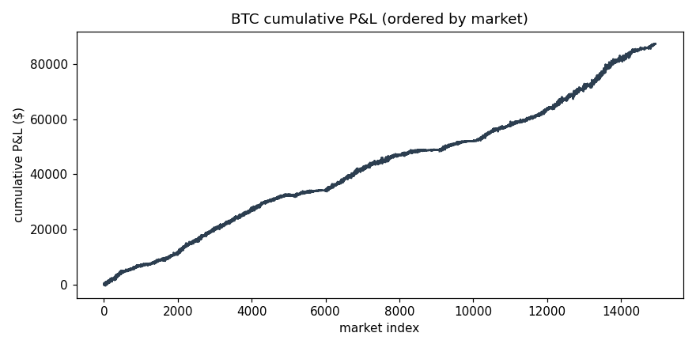

*Cumulative P&L across markets (consistency).*

### btc pair cost hist

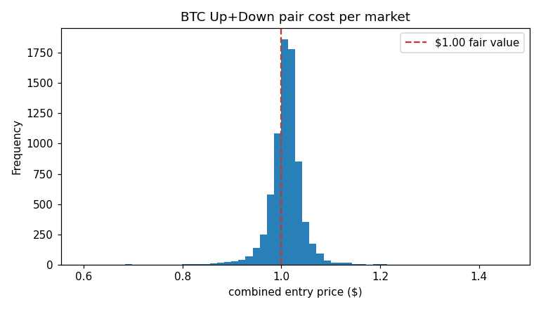

*Combined Up+Down entry cost per market; left of the red line = hedge bought under fair value.*

### btc edge bar

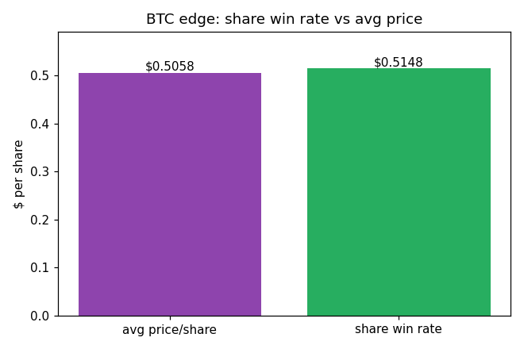

*Edge source: winning-share rate above avg price paid = profit/share.*

### btc winner lean by trade

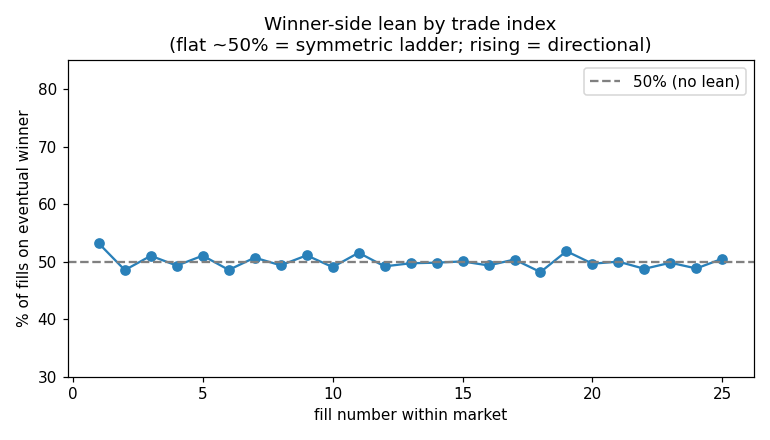

*Whether the book tilts toward the winner as the window progresses.*

### btc choppiness edge

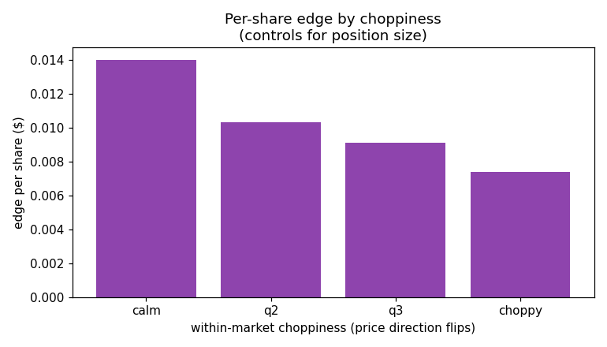

*Per-share edge vs market choppiness; calmer markets = better fills.*

